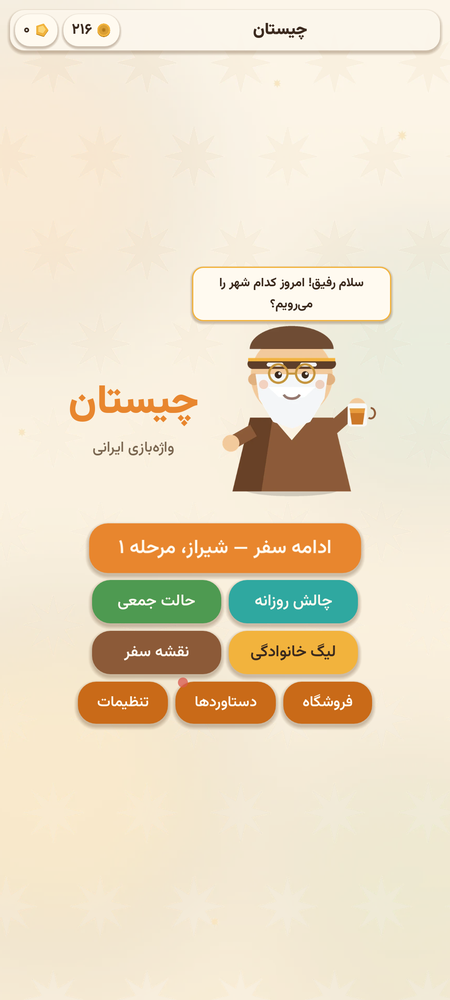
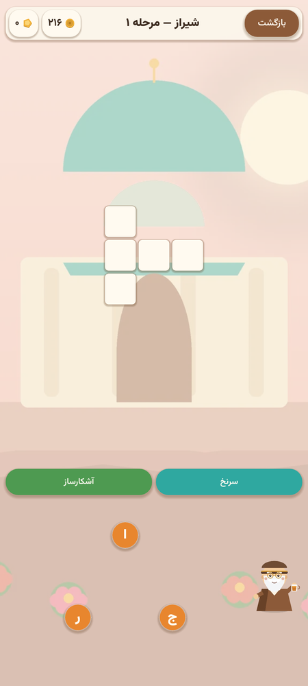
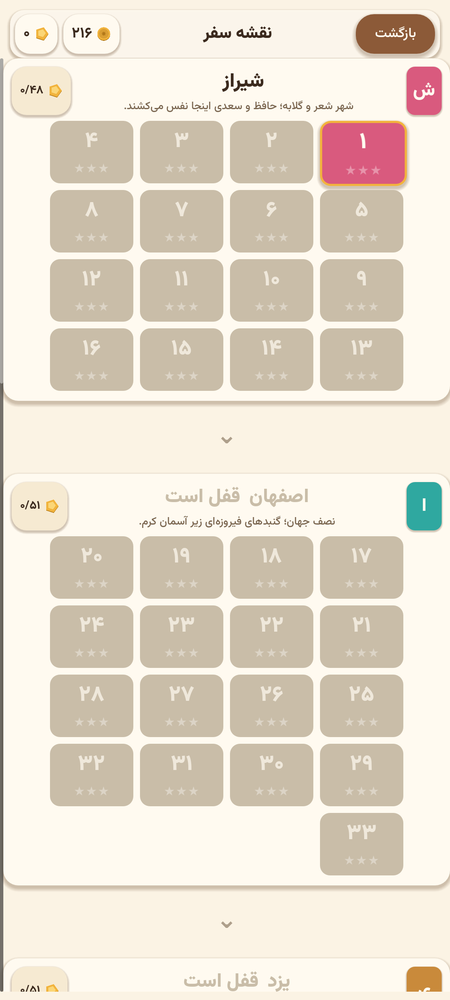
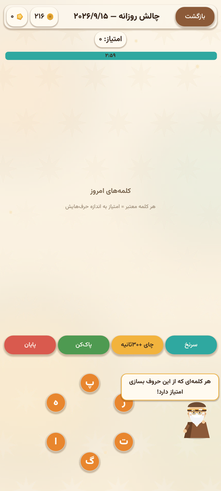
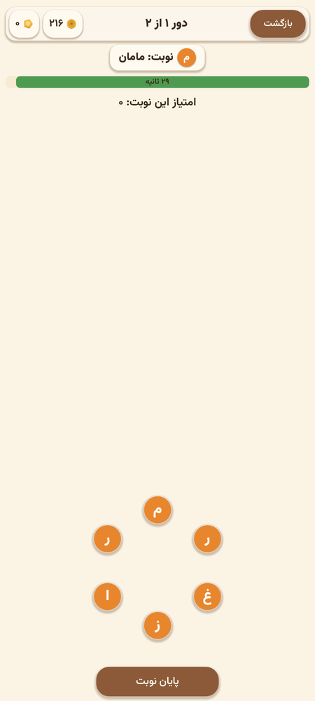
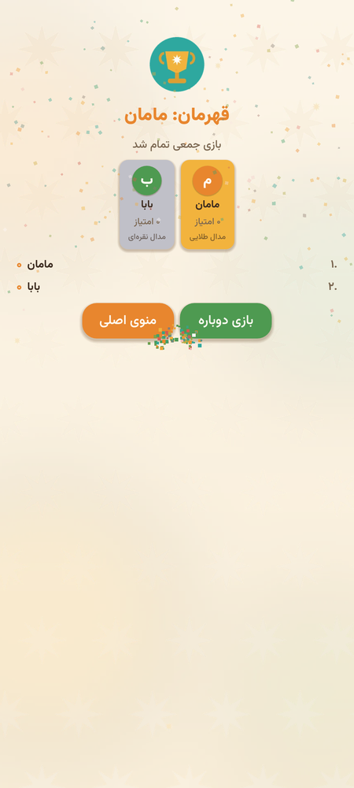

<div dir="rtl">

# 🎲 چیستان — واژه‌بازی ایرانی

**چیستان** یک بازی پازل کلمات فارسی برای اندروید است که با موتور **گودو ۴** ساخته شده؛ سفری شعرآمیز از شیراز تا مشهد همراه با پدربزرگ مهربان، با موسیقی زنده‌ی سازهای ایرانی، جدول‌های تقاطعی و ده‌ها ساعت سرگرمی واژه‌ای.

<div dir="ltr">

| | |
|---|---|
| 🏗️ **Engine** | Godot 4.7 (GL Compatibility — مناسب همه گوشی‌ها) |
| 📱 **Platform** | Android 7+ (APK & AAB) |
| 🧩 **Levels** | ۱۰۰ مرحله دست‌ساز در ۶ شهر ایران |
| 🎶 **Audio** | موسیقی تولیدشده با گام‌های اصیل (شور، همایون، ماهور، دشتی…) |
| 🌍 **Language** | کاملاً فارسی |

</div>

## 📸 نگاهی به بازی

| منوی اصلی | مرحله ۱ — شیراز | نقشه سفر |
|:---:|:---:|:---:|
|  |  |  |
| **چالش روزانه** | **حالت جمعی** | **جشن قهرمانی** |
|  |  |  |

---

## ✨ امکانات بازی

- 🗺️ **سفر شش‌شهری** — شیراز، اصفهان، یزد، تبریز، رشت و مشهد؛ هر شهر با رنگ، پس‌زمینه، حال‌وهوا و موسیقی مخصوص خودش
- 🧩 **جدول تقاطعی واقعی** — کلمات با کشیدن انگشت روی چرخ حروف کشف می‌شوند، مثل آمیرزا اما با چیدمان متقاطع و جلوه‌های نرم
- 💎 **کلمات بونوس** — کلمه‌های پنهان هر مرحله را پیدا کن و سکه جایزه بگیر
- 🌗 **چالش روزانه** — هر روز یک چرخ تازه با تایمر ۳ دقیقه‌ای؛ استریک روزانه نگه دار تا جایزه هفته طلایی بگیری
- 🎉 **حالت جمعی** — تا ۸ نفر روی یک گوشی! هر نفر ۳۰ ثانیه نوبت دارد؛ در پایان مدال و تاج قهرمانی
- 🏆 **لیگ خانوادگی** — رقابت ۵/۱۰/۲۰ دوری با جدول رکوردها (بلندترین کلمه، بیشترین امتیاز، قهرمانی‌ها)
- 🎁 **هدیه روزانه** — تقویم ۷ روزه پدربزرگ با جایزه‌های فزاینده
- 🛍️ **فروشگاه** — سرنخ، آشکارساز، چای زمان‌افزا، پاک‌کن و تم‌های رنگی
- 🏅 **۲۰ دستاورد** با جایزه سکه‌ای
- 👴 **پدربزرگ** — قهرمان بازی؛ راهنماییت می‌کند، تشویقت می‌کند و چای‌ات را دم می‌کند!
- ✨ **جلوه‌های ویژه کامل** — انیمیشن فشار دکمه‌ها، کانفتی، پاپ امتیاز، لرزش، صداهای ترکیبی و …

## 🆕 تغییرات نسخه ۱.۱.۰

این نسخه یک بازسازی کامل روی کیفیت و حجم است:

- 🐞 **رفع کامل تداخل رابط کاربری** — همه صفحه‌ها با کانتینرهای استاندارد گودو بازنویسی شدند؛ جدول و چرخ حروف در هر رزولوشنی (۱۶:۹ تا ۲۱:۹ و تبلت) درست می‌نشینند
- 🪞 **رابط راست‌به‌چپ واقعی** — دکمه بازگشت راست، اعداد و ترتیب ویجت‌ها فارسی
- 📦 **حجم ۷۱MB → حدود ۳۵MB** — فقط معماری arm64، فشرده‌سازی کتابخانه‌ها و بازطراحی هنر (۳۰MB → ۰.۶MB)
- 🎨 **هنر کاملاً جدید** — تصاویر فلت‌دیزاین دست‌ساز: پدربزرگ سه‌حالته، شش شهر با نماد معماری ایران، آیکون‌ها و آیکون لانچر «چ»
- 💬 **حباب گفتار پدربزرگ** — همیشه داخل کادر صفحه و در جای درست
- 🧪 **تست خودکار + بازبینی بصری** — ۱۴ سناریوی خودکار و اسکرین‌شات از همه صفحه‌ها پیش از انتشار

## 📲 نصب روی اندروید

### راه اول: فایل آماده (پیشنهادی)
۱. به صفحه [Releases این ریپو](https://github.com/Nikzadcrr/chistan/releases) برو  
۲. در نسخه **v1.1.0** فایل `chistan.apk` را دانلود کن  
۳. فایل را روی گوشی منتقل و نصب کن (اجازه «نصب از منابع ناشناس» را بده)

> برای انتشار در گوگل‌پلی، فایل `chistan.aab` در همان صفحه موجود است.

### راه دوم: دانلود از Actions (بیلدهای تازه)
۱. به صفحه [Actions این ریپو](https://github.com/Nikzadcrr/chistan/actions) برو  
۲. آخرین بیلد سبز را باز کن  
۳. از بخش **Artifacts** فایل `chistan-release-apk` را دانلود کن  

### راه سوم: بیلد خودت با گودو
```bash
git clone https://github.com/Nikzadcrr/chistan.git
cd chistan
# با گودو ۴.۷ باز کن و از منوی Project > Export خروجی Android بگیر
```
راهنمای کامل: [docs/BUILD-android.md](docs/BUILD-android.md)

## 🛠️ اجرا روی کامپیوتر
```bash
# دانلود گودو ۴.۷ از godotengine.org
godot --path .          # یا پروژه را در ادیتور باز کن
```

## 🗂️ ساختار پروژه
```
chistan/
├─ assets/
│  ├─ art/          # پدربزرگ، پس‌زمینه شهرها، آیکون‌ها
│  ├─ audio/        # موسیقی شهرها (ogg) و افکت‌ها (wav)
│  ├─ data/         # دیکشنری، ۱۰۰ مرحله، شهرها، دستاوردها، فروشگاه
│  └─ fonts/        # وزیرمتن
├─ scripts/
│  ├─ autoload/     # Data، Save، Sound، Game، Router
│  ├─ ui/           # UiKit، چرخ حروف، جدول تقاطعی، جلوه‌ها
│  └─ screens/      # ۱۲ صفحه بازی
├─ tools/           # ژنراتورهای پایتون (داده، صدا، هنر)
└─ .github/         # بیلد خودکار اندروید
```

## ⚙️ بیلد خودکار (CI)
هر push به `main` باعث ساخت **APK دیباگ + APK ریلیز + AAB ریلیز (امضاشده)** می‌شود.  
برای انتشار در گوگل‌پلی، AAB ریلیز را از Artifacts بردارید.

## 📜 مجوزها و اعتبارها
- کد و طراحی: ساخت اختصاصی برای این پروژه
- فونت [وزیرمتن](https://github.com/rastikerdar/vazirmatn) — مجوز OFL
- موتور [Godot](https://godotengine.org) — مجوز MIT

</div>
